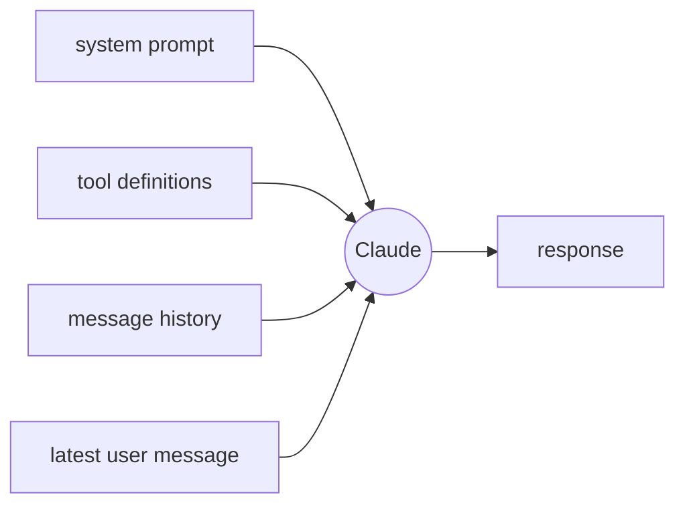
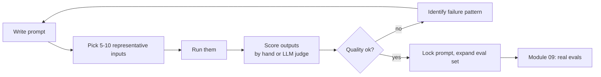

# 01 — Prompting

By the end of this module you can:

1. Structure a prompt the way Claude prefers.
2. Use system prompts, XML tags, and few-shot examples deliberately.
3. Decide between chain-of-thought, extended thinking, and "just answer."
4. Iterate on a prompt empirically instead of by vibes.

Time budget: ~60 minutes reading, ~60 minutes lab + exercises.

---

## 1. The mental model: instructions, not incantations

Modern Claude models follow instructions well. You don't need magic phrases. What matters is **clarity, structure, and concrete examples** — in roughly that order.

A prompt is a contract:
- *What the assistant is.* (system)
- *What the user wants.* (latest message)
- *What good output looks like.* (examples, structure, constraints)
- *What it should NOT do.* (out-of-scope, safety, format violations)

If you can't write that contract clearly to a human, the model can't follow it either.

---

## 2. The four slots Claude reads first



| Slot | Use it for | Don't put |
|---|---|---|
| `system` | Persistent role, output format, constraints, domain knowledge | Per-turn user input |
| Tool defs | Function names, schemas, when to call them | Conversation content |
| Earlier messages | Few-shot examples, prior turns, retrieved context | One-off instructions you keep re-pasting |
| Latest user message | The actual task | Stable rules — those go in `system` |

A common beginner mistake: putting role/format rules in every user message. Put them in `system` once. They get cached and stay consistent.

---

## 3. Structure with XML tags

Claude was post-trained heavily on XML-tagged prompts. Tags are how you tell the model "these things are different from each other."

```text
<task>
Summarize the document in 3 bullets.
</task>

<document>
{paste the doc here}
</document>

<constraints>
- Each bullet is one sentence.
- No marketing language.
- Output JSON: {"bullets": [...]}
</constraints>
```

You can name tags anything — `<task>`, `<context>`, `<example>`, `<rules>`, `<output_format>` are common. Stay consistent within a prompt.

**Why this matters more than markdown headings:**
- The model treats tags as semantic regions, not formatting noise.
- You can reference them: *"Use only facts from `<document>`."*
- They survive copy-paste and concatenation cleanly.

---

## 4. The minimum viable prompt template

For most non-trivial tasks, start here and trim:

```text
You are <role>. Your job is to <one-sentence goal>.

<instructions>
1. <step or rule>
2. <step or rule>
3. <step or rule>
</instructions>

<rules>
- <hard constraint, e.g. "Never invent citations.">
- <hard constraint>
</rules>

<output_format>
Respond as <JSON|markdown|XML> with this shape:
{ ... }
</output_format>

<example>
<input>...</input>
<output>...</output>
</example>
```

The user turn then carries only the task-specific payload (e.g. the document to summarize).

---

## 5. Few-shot examples

Examples beat descriptions. If you can show 1–5 input → output pairs, the model will mimic the *shape* of your outputs (length, tone, structure) far more reliably than from prose rules.

Rules of thumb:
- **1–3 examples** is the sweet spot for most tasks.
- Use *real* examples, not synthetic ones if you can.
- Cover the **edge cases** you care about, not just the easy path.
- Wrap them in `<example>` tags so they're distinct from the live task.
- If you find the model copying example *content* (not just shape), make examples more varied or more abstract.

```text
<examples>
<example>
<input>What is 2+2?</input>
<output>4</output>
</example>
<example>
<input>What is 17 * 23?</input>
<output>391</output>
</example>
</examples>

<task>
What is 39 * 41?
</task>
```

---

## 6. Chain-of-thought vs extended thinking

Two different things.

**Plain CoT (prompted):**
> "Think step by step before answering."

This works, but on Claude 4.x it's usually inferior to **extended thinking**, a built-in feature where the model produces internal reasoning blocks before the final answer:

```python
response = client.messages.create(
    model="claude-sonnet-4-6",
    max_tokens=4096,
    thinking={"type": "enabled", "budget_tokens": 8000},
    messages=[{"role": "user", "content": "Solve: ..."}],
)
```

- Use **extended thinking** for math, code reasoning, multi-step planning, agent decisions.
- Use **plain CoT (no thinking)** when latency matters more than depth, or when you want the reasoning visible *to the user*.
- For trivial tasks (classification, extraction with clear rules) — neither. They add tokens for no gain.

We'll go deeper in Module 05.

---

## 7. Output formatting

Three good ways to constrain output:

| Method | When |
|---|---|
| **Plain instructions** ("respond as JSON: {...}") | Fast, flexible; works ~99% with a good schema example. |
| **Prefilling assistant turn** | Force a specific opening — see below. Strongest control. |
| **Tool use as structured output** | When the schema is complex / nested; Module 03 covers this. |

### Prefilling

You can seed the assistant's reply. Claude continues from where you left off:

```python
messages=[
    {"role": "user", "content": "Give me JSON with two keys: city, country, both for Tokyo."},
    {"role": "assistant", "content": "{"},   # prefill
]
# response.content[0].text will start with the rest of the JSON
```

This is the most reliable way to *guarantee* the first character is `{` or `[` or `<answer>`.

> Caveat: with prefill, the model won't produce the prefilled tokens — your post-processing must prepend them back to the response.

---

## 8. Prompt patterns that earn their keep

| Pattern | One-liner |
|---|---|
| **Role + Goal** | "You are X. Your job is to Y." Anchors style and scope. |
| **Numbered steps** | When order matters, number them; the model follows order. |
| **Negative rules** | "Never do X" beats "Try to avoid X". |
| **Reference inputs** | "Use only facts from `<document>`. If unsure, say *unknown*." |
| **Format anchor** | A worked example showing the exact output shape. |
| **Self-critique** | "Before answering, list 3 ways your draft could be wrong, then revise." |
| **Two-pass** | First call drafts, second call critiques. Use sparingly — costs 2×. |

---

## 9. Anti-patterns to delete from your habits

- "You are the world's leading expert in…" — fluff, no measurable lift.
- "Take a deep breath…" — old trick; no longer needed for Claude 4.x.
- Burying the question at the bottom of 5K tokens of context. Put the *ask* near the top *and* the bottom; the model attends to both ends.
- Asking for "creative" output while giving rigid format rules — pick one.
- Telling the model what *not* to think — describe the desired behavior instead.

---

## 10. The empirical loop

Stop guessing. Iterate like this:



Most prompt "improvements" are noise without a fixed eval set. Even 10 hand-graded inputs is enough to know whether a change is a real win.

---

## 11. What to do with the lab

Open [`lab.ipynb`](./lab.ipynb). You'll:
- Refactor a bad prompt into a structured one.
- Add few-shot examples to a classification task and measure the lift on a 10-example set.
- Use prefill to force a strict JSON shape.

Then try the exercises.

---

## References

- Prompt engineering overview: <https://docs.claude.com/en/docs/build-with-claude/prompt-engineering/overview>
- Use XML tags: <https://docs.claude.com/en/docs/build-with-claude/prompt-engineering/use-xml-tags>
- Extended thinking: <https://docs.claude.com/en/docs/build-with-claude/extended-thinking>
- Prefilling responses: <https://docs.claude.com/en/docs/build-with-claude/prompt-engineering/prefill-claudes-response>
