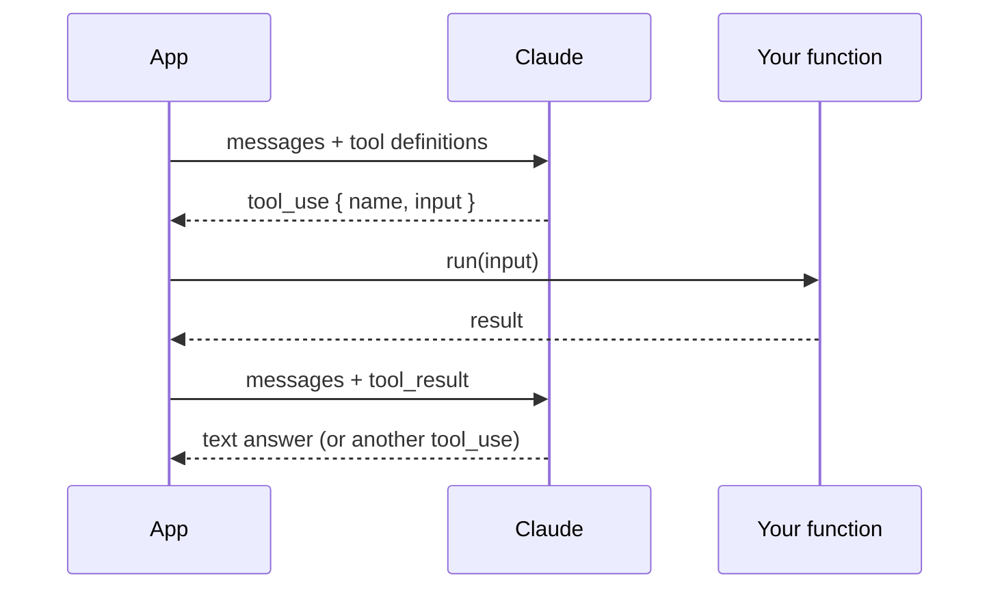

# 03 — Tool use

By the end you can:

1. Define tools with JSON Schema and pass them to Claude.
2. Run a full tool-use loop end-to-end.
3. Use `tool_choice` to force / allow / forbid tool calls.
4. Handle parallel tool calls and tool errors.
5. Use tool calling as your structured-output mechanism.

Time budget: ~75 minutes reading, ~75 minutes lab.

---

## 1. What tool use actually is

The model **never** runs your code. It returns a `tool_use` block describing the call it wants. **You** run the function and send the result back as a `tool_result` block. The model then continues from there.



This loop continues until `stop_reason == "end_turn"`.

---

## 2. Defining a tool

A tool is `{name, description, input_schema}` — input_schema is plain JSON Schema.

```python
TOOLS = [
    {
        "name": "get_weather",
        "description": "Get current weather for a city. Returns temperature in Celsius.",
        "input_schema": {
            "type": "object",
            "properties": {
                "city": {"type": "string", "description": "City name, e.g. 'Tokyo'."},
                "units": {"type": "string", "enum": ["c", "f"], "default": "c"},
            },
            "required": ["city"],
        },
    }
]
```

What matters in the schema:

| Element | Why it matters |
|---|---|
| `description` (tool-level) | The model reads this to decide *when* to call. Be specific about side effects. |
| `description` (per-property) | Tells the model what values are valid; cuts hallucinated args. |
| `required` | Without it, the model may omit fields. |
| `enum` | Locks values; the model can't invent new ones. |
| `type` constraints | The model usually obeys; your code should still validate. |

Treat the tool description as a mini-prompt. "Get weather" is fine; "Get current weather, only for cities (not landmarks); returns Celsius unless `units='f'`; do not call for forecasts" is *much* better.

---

## 3. The minimal tool loop

```python
TOOLS = [...]  # as above
TOOL_FNS = {"get_weather": real_get_weather}

def run_with_tools(user_text: str) -> str:
    messages = [{"role": "user", "content": user_text}]

    while True:
        r = client.messages.create(
            model=MODEL,
            max_tokens=1024,
            tools=TOOLS,
            messages=messages,
        )
        # Always append the assistant turn before deciding next step.
        messages.append({"role": "assistant", "content": r.content})

        if r.stop_reason == "end_turn":
            return "".join(b.text for b in r.content if b.type == "text")

        if r.stop_reason == "tool_use":
            tool_results = []
            for block in r.content:
                if block.type != "tool_use":
                    continue
                fn = TOOL_FNS[block.name]
                try:
                    result = fn(**block.input)
                    tool_results.append({
                        "type": "tool_result",
                        "tool_use_id": block.id,
                        "content": str(result),
                    })
                except Exception as e:
                    tool_results.append({
                        "type": "tool_result",
                        "tool_use_id": block.id,
                        "content": f"ERROR: {e}",
                        "is_error": True,
                    })
            messages.append({"role": "user", "content": tool_results})
            continue

        # Unexpected stop_reason (max_tokens, etc.)
        raise RuntimeError(f"Unexpected stop: {r.stop_reason}")
```

Things to notice:
- The assistant's tool_use is in role `assistant`; the tool_result is in role `user`. That's the spec.
- You can return tool_results for **multiple** tool_use blocks in one user turn.
- Set `is_error: true` so the model knows the call failed and can adapt.

---

## 4. `tool_choice`

| Setting | Behavior |
|---|---|
| `{"type": "auto"}` | Default. Model picks: text or tool call. |
| `{"type": "any"}` | Model MUST call some tool (not text). Use for forced extraction. |
| `{"type": "tool", "name": "get_weather"}` | Force a specific tool. Great for structured outputs. |
| `{"type": "none"}` | Forbid tool calls (e.g. for the final synthesis turn). |

A common production pattern: keep `auto` during the tool loop, but switch to `{"type": "none"}` on the **last** call to force a final synthesized answer.

---

## 5. Parallel tool calls

Claude can emit multiple `tool_use` blocks in one response. Run them concurrently:

```python
import asyncio

async def run_one(block):
    fn = TOOL_FNS[block.name]
    return {
        "type": "tool_result",
        "tool_use_id": block.id,
        "content": str(await asyncio.to_thread(fn, **block.input)),
    }

async def gather_tool_results(blocks):
    return await asyncio.gather(*(run_one(b) for b in blocks if b.type == "tool_use"))
```

To *disable* parallel calling — useful for tools with order dependencies — set `disable_parallel_tool_use=True` in `tool_choice`:

```python
tool_choice={"type": "auto", "disable_parallel_tool_use": True}
```

---

## 6. Structured outputs via forced tool

Forget asking for "JSON in your response." Define a tool whose schema *is* your output, force it, and harvest `tool_use.input`:

```python
EXTRACT = {
    "name": "save_invoice",
    "description": "Record an invoice extracted from the document.",
    "input_schema": {
        "type": "object",
        "properties": {
            "vendor": {"type": "string"},
            "total": {"type": "number"},
            "currency": {"type": "string", "enum": ["USD", "EUR", "INR"]},
            "due_date": {"type": "string", "description": "YYYY-MM-DD"},
        },
        "required": ["vendor", "total", "currency", "due_date"],
    },
}

r = client.messages.create(
    model=MODEL,
    max_tokens=512,
    tools=[EXTRACT],
    tool_choice={"type": "tool", "name": "save_invoice"},
    messages=[{"role": "user", "content": invoice_text}],
)

extracted = next(b.input for b in r.content if b.type == "tool_use")
# extracted is a dict matching the schema; no JSON parsing needed
```

This is the **most reliable** way to get structured data out of Claude.

---

## 7. Tool design rules of thumb

| Rule | Why |
|---|---|
| **One verb per tool.** | `create_ticket` good. `manage_ticket` bad — the model won't know which mode you mean. |
| **Side-effect tools should say so.** | `"This sends an email. Do not call without explicit user confirmation."` |
| **Idempotent retries.** | Tools may be called twice on retry. Build in idempotency keys when it matters. |
| **Return shape matches description.** | If you say "returns JSON with keys X and Y", actually do that. |
| **Small surface area.** | 3 good tools beat 12 vague ones. The model picks better. |
| **Validate inputs server-side.** | Treat tool args like untrusted input. Schema doesn't run on the model side. |

---

## 8. Error handling

Three failure modes:

1. **Tool execution failure.** Return `is_error: true` with a short, actionable message. The model can recover ("Retry with a different city").
2. **Schema mismatch.** Rare with modern Claude but happens. Validate with Pydantic and treat as a tool error.
3. **Infinite tool loop.** Cap iterations:

   ```python
   for _ in range(MAX_TURNS):
       ...
   raise RuntimeError("tool loop exceeded MAX_TURNS")
   ```

---

## 9. Cost & latency notes

- Tool definitions are sent on **every** call in the loop. They count toward input tokens. **Cache them** (Module 05).
- Long tool-use loops mean N round-trips × network latency. Parallelize where you can.
- Returning huge tool_result payloads gets expensive — chunk and summarize on the *tool* side, not in the next model call.

---

## 10. Lab

[`lab.ipynb`](./lab.ipynb) builds:
- A weather + calculator tool loop end-to-end.
- A structured invoice extractor using forced tool choice.
- A parallel multi-tool dispatcher.

---

## References

- Tool use overview: <https://docs.claude.com/en/docs/build-with-claude/tool-use/overview>
- How to implement: <https://docs.claude.com/en/docs/build-with-claude/tool-use/implementation>
- `tool_choice`: <https://docs.claude.com/en/docs/build-with-claude/tool-use/tool-choice>
- JSON Schema spec: <https://json-schema.org/>
