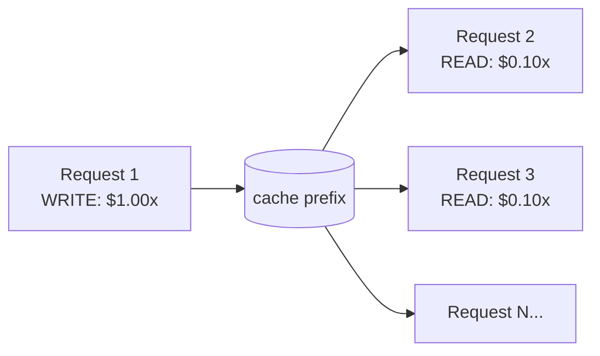
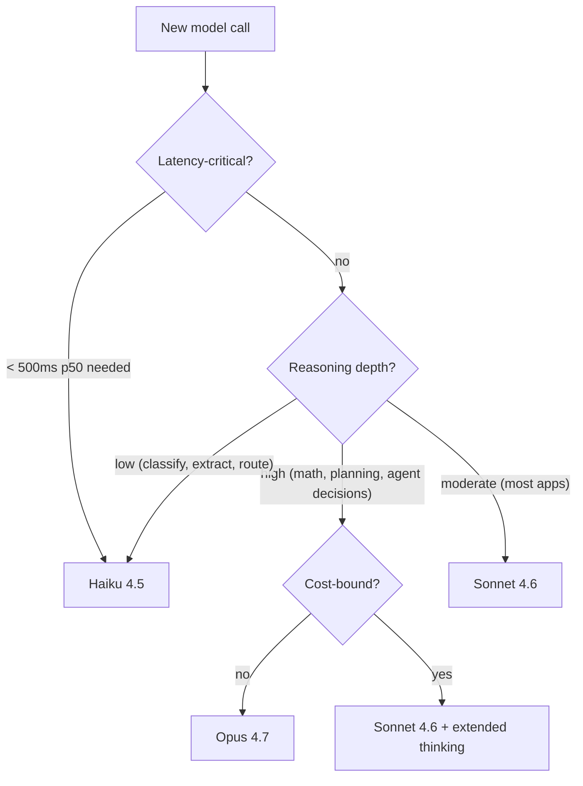

# 05 — Advanced API features

By the end you can:

1. Use prompt caching to cut input costs by ~90% on repeated prefixes.
2. Use the Batch API for cheap, async, large-volume work.
3. Use extended thinking effectively (and know when to skip it).
4. Pick a model for the job using a concrete rubric.

Time budget: ~75 minutes reading, ~75 minutes lab.

---

## 1. Prompt caching — the single biggest cost lever

When your requests share a prefix (system prompt, tool definitions, large RAG context, conversation history), you can mark a cache breakpoint and Anthropic stores the prefix server-side. Subsequent requests hitting the same prefix pay roughly **10% of normal input cost** for those tokens.



| TTL | Use when | Cost multiplier on write |
|---|---|---|
| **5 minutes** (default) | Interactive chat, agent loops | ~1.25× normal input |
| **1 hour** | Long-running pipelines, batch warmups | ~2× normal input |

Reads are always cheap (~0.1×) regardless of TTL.

### Where to put breakpoints

```python
system = [
    {"type": "text", "text": LARGE_SYSTEM_PROMPT,
     "cache_control": {"type": "ephemeral"}},   # default TTL = 5min
]

tools = [
    {**tool_def, "cache_control": {"type": "ephemeral"}},   # cache tool defs too
]

messages = [
    {"role": "user", "content": [
        {"type": "document", "source": {...},
         "cache_control": {"type": "ephemeral", "ttl": "1h"}},
        {"type": "text", "text": user_question},
    ]},
]
```

Up to **4 cache breakpoints** per request. Everything *up to and including* a breakpoint becomes cacheable as a contiguous prefix.

### What counts as the "same prefix"

The cache key is the byte-exact content up to the breakpoint, in order. Any change — even a comma — invalidates downstream. So:

- Put **stable** content first (system prompt, tools, large docs).
- Put **variable** content last (user's latest message).
- Don't include timestamps, request IDs, or user names in your cached prefix.

### Measuring cache hits

Every response includes:

```python
r.usage.cache_creation_input_tokens   # written this request
r.usage.cache_read_input_tokens       # read from cache this request
r.usage.input_tokens                  # non-cached input (your delta)
```

A healthy production loop has `cache_read_input_tokens` >> `input_tokens`.

---

## 2. Batch API — half the price, no rush

For workloads you can wait minutes-to-hours for (offline labeling, eval runs, document processing pipelines): submit thousands of requests in one batch and pay **50% less** per token. Results return within 24 hours, usually much sooner.

```python
batch = client.messages.batches.create(
    requests=[
        {
            "custom_id": f"row-{i}",
            "params": {
                "model": MODEL,
                "max_tokens": 256,
                "messages": [{"role": "user", "content": row}],
            },
        }
        for i, row in enumerate(rows)
    ],
)

# Poll until done
import time
while True:
    b = client.messages.batches.retrieve(batch.id)
    if b.processing_status == "ended":
        break
    time.sleep(30)

# Stream results
for result in client.messages.batches.results(batch.id):
    print(result.custom_id, result.result.type)
```

When to use Batch:
- Eval runs on thousands of inputs.
- Nightly classification jobs.
- Backfilling embeddings or summaries on a content corpus.
- Anything where 50% cost > minutes-of-latency.

When **not** to use Batch:
- Interactive UX.
- Anything needing immediate retries.
- Streaming.

---

## 3. Extended thinking

Lets the model produce internal reasoning tokens before its final answer.

```python
r = client.messages.create(
    model=MODEL,
    max_tokens=8192,
    thinking={"type": "enabled", "budget_tokens": 4000},
    messages=[{"role": "user", "content": "Prove that ..."}],
)

for b in r.content:
    if b.type == "thinking":
        ...   # reasoning trace
    elif b.type == "text":
        ...   # final answer
```

| Use it for | Skip it for |
|---|---|
| Math, proofs, complex reasoning | Classification, extraction, lookups |
| Multi-step planning (agents) | Anything under ~200 token answers |
| Code-from-spec where correctness matters | Short factual questions |
| Eval-graded "best possible answer" runs | Latency-critical loops |

**Cost & latency:** thinking tokens are billed at output rate and add to total latency. Budget them: `budget_tokens=4000` is plenty for most reasoning; 16K+ for unusually hard problems.

You can **stream thinking** to show users "thinking…" indicators tied to actual reasoning progress.

---

## 4. Structured outputs

Three ways to get structured data out, ranked by reliability:

| Method | Reliability | When to use |
|---|---|---|
| **Forced tool use** (`tool_choice={"type":"tool", ...}`) | Highest | Production extraction, anything schema-validated |
| **Prefilling** (`assistant: "{"`) | High | One-off scripts, ad-hoc JSON |
| **Plain instructions** ("return JSON") | Moderate | Quick prototypes |

For complex nested schemas, the forced tool approach beats everything else. The schema lives in the tool's `input_schema`; the response is `tool_use.input` already as a dict.

For Pydantic types:

```python
from pydantic import BaseModel

class Invoice(BaseModel):
    vendor: str
    total: float
    due_date: str

tool = {
    "name": "save_invoice",
    "description": "Record an invoice.",
    "input_schema": Invoice.model_json_schema(),
}
```

Pydantic gives you the schema; the tool gives you reliability; `Invoice(**block.input)` gives you a typed object on the way back.

---

## 5. Model selection — a rubric you can apply

Build the question into your code. For every model call, check these three:



| Failure mode | Suggested move |
|---|---|
| Answers are *almost* right but lose subtle nuance | Step up: Haiku → Sonnet, or enable extended thinking |
| Cost line item is dominated by simple extractions | Step down: Sonnet → Haiku, with a forced-tool schema |
| Long latency on agent loops | Cache prefixes; switch routing-style turns to Haiku |
| Inconsistent JSON in extraction | Don't change models — switch to forced tool use |

Don't pin a model globally for the whole app. **Pin per call-site.** A chat orchestrator can run on Sonnet while its router runs on Haiku and its critic runs on Opus.

---

## 6. Combining the features

Putting it all together for a RAG-style summarization service:

```python
SYSTEM = [
    {"type": "text", "text": SYSTEM_PROMPT_TEXT,
     "cache_control": {"type": "ephemeral", "ttl": "1h"}},
]

def summarize(doc_id: str, question: str) -> str:
    doc_block = {
        "type": "document",
        "source": {"type": "file", "file_id": doc_id},
        "citations": {"enabled": True},
        "cache_control": {"type": "ephemeral", "ttl": "1h"},
    }
    r = client.messages.create(
        model="claude-sonnet-4-6",
        max_tokens=1024,
        system=SYSTEM,
        messages=[{"role": "user", "content": [doc_block, {"type": "text", "text": question}]}],
    )
    print(f"cache: read={r.usage.cache_read_input_tokens} write={r.usage.cache_creation_input_tokens}")
    return r.content[0].text
```

The doc is cached for 1 hour. First request for a doc writes the cache; every subsequent question about the same doc pays ~10% of the doc's input cost.

---

## 7. Lab

[`lab.ipynb`](./lab.ipynb) demonstrates:
- Measuring cache hit/miss explicitly.
- Submitting and polling a small Batch.
- Comparing thinking-enabled vs disabled on a math problem.

---

## References

- Prompt caching: <https://docs.claude.com/en/docs/build-with-claude/prompt-caching>
- Batch API: <https://docs.claude.com/en/docs/build-with-claude/batch-processing>
- Extended thinking: <https://docs.claude.com/en/docs/build-with-claude/extended-thinking>
- Pricing: <https://docs.claude.com/en/docs/about-claude/pricing>
