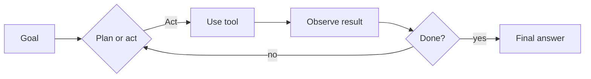
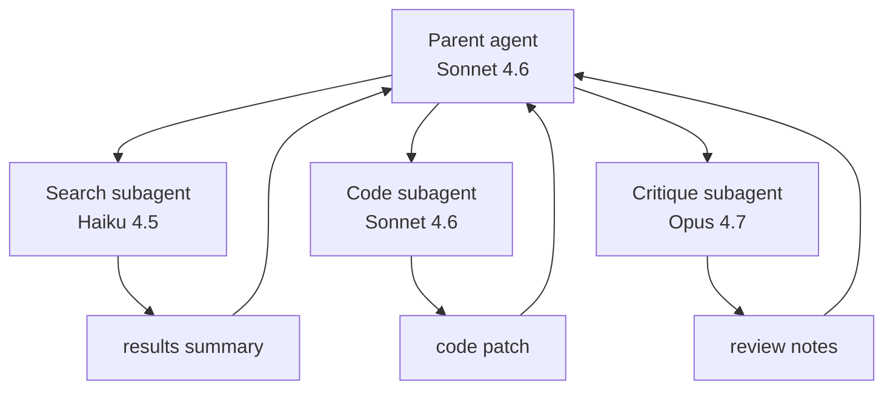

# 06 — Agents & Agent SDK

By the end you can:

1. Define what an "agent" is (and isn't) in concrete terms.
2. Hand-roll an agent loop on top of tool use.
3. Use the Claude Agent SDK to get loops, memory, and subagents out of the box.
4. Choose between ReAct, plan-then-execute, and "single-shot with tools".

Time budget: ~75 minutes reading, ~90 minutes lab.

---

## 1. What an agent is

An agent is **an LLM that decides what to do next in a loop until a goal is reached**. The differentiator from a single tool-use turn is *autonomy over multiple steps*:



A "Module 03 tool loop" is already an agent in this sense. Module 06 just adds:
- **Memory** across loop iterations (and sometimes across sessions).
- **Subagents** for parallelizing or isolating contexts.
- **Planning patterns** that improve robustness on harder goals.

---

## 2. When NOT to use an agent

Most production wins come from **avoiding** agents when a single call would do.

| Symptom | Try first |
|---|---|
| "I need to extract structured data from X" | Module 03 forced tool use, single call |
| "I need to answer Q&A over a single doc" | Module 04 multimodal, single call with caching |
| "I need to summarize 1000 docs" | Module 05 Batch API |
| "I need a chatbot that answers FAQs" | Single-call with RAG retrieval before the call |
| "I need to triage incoming tickets" | Haiku classifier; only escalate to an agent on complex cases |

Agents are right when:
- The path through the task isn't knowable upfront.
- Each step's input depends on prior step's output.
- The goal is open-ended (research, debugging, code generation across a repo).

---

## 3. Hand-rolled agent loop

This is the Module 03 loop with two extensions: a *plan* phase and a *step budget*.

```python
SYSTEM = """You are a research agent. To answer the user, you may call tools
multiple times. Before acting, briefly plan in <plan>...</plan>. When you have
enough information, give a final answer with no tags."""

def agent_loop(user_goal: str, max_steps: int = 10) -> str:
    messages = [{"role": "user", "content": user_goal}]
    for step in range(max_steps):
        r = client.messages.create(
            model=MODEL,
            max_tokens=2048,
            system=SYSTEM,
            tools=TOOLS,
            messages=messages,
        )
        messages.append({"role": "assistant", "content": r.content})

        if r.stop_reason == "end_turn":
            return _final_text(r)
        if r.stop_reason == "tool_use":
            messages.append({"role": "user", "content": _run_tools(r.content)})
            continue
        raise RuntimeError(f"unexpected stop: {r.stop_reason}")
    raise RuntimeError("step budget exhausted")
```

The `<plan>` tag isn't enforced — it's a soft cue that nudges the model to articulate its approach. For higher reliability, switch to extended thinking (Module 05).

---

## 4. Memory

Two flavors:

| Memory type | Scope | Implementation |
|---|---|---|
| **Working memory** | Within a single agent loop | Just `messages[]`; trim or summarize when long |
| **Long-term memory** | Across sessions | External store (vector DB, KV store, file system) |

A simple long-term memory pattern:

```python
def remember(key: str, value: str):
    """Tool exposed to the agent."""
    redis.set(f"mem:{user_id}:{key}", value)

def recall(query: str) -> str:
    """Tool exposed to the agent."""
    # vector or fuzzy lookup; return top match
    return redis.get(...)
```

Expose `remember`/`recall` as tools and let the model decide when to store/fetch. Keep what's stored auditable: an agent that can write to memory is an agent that can poison its own context.

---

## 5. The Claude Agent SDK

The Claude Agent SDK packages the loop, tool registry, memory, subagents, and streaming into one library. You define tools and goals; it handles the loop.

```python
# pip install claude-agent-sdk
from claude_agent_sdk import Agent, tool

@tool
def get_weather(city: str) -> str:
    """Get current weather for a city."""
    return mock_weather(city)

agent = Agent(
    model="claude-sonnet-4-6",
    system="You are a helpful travel assistant.",
    tools=[get_weather],
)

result = agent.run("Should I bring a jacket to London tomorrow?")
print(result.text)
```

Why use it:
- **Less boilerplate.** No hand-written loop.
- **Streaming + thinking** wired in.
- **Subagent support** — spawn child agents for isolated work.
- **Hooks** — pre/post tool execution interceptors for logging, redaction, etc.
- **Memory primitives** — built-in working memory and pluggable long-term backends.

Why you'd still hand-roll:
- You need exotic control flow the SDK doesn't model.
- You're embedding inside an existing framework (LangGraph, custom orchestration).
- You're educating yourself (do it once by hand; then never again).

> The SDK is evolving rapidly. Always pin a specific version in `requirements.txt` and check the changelog: <https://github.com/anthropics/claude-agent-sdk-python>.

---

## 6. Subagents

A subagent is a child agent with its own messages list and tool set. The parent delegates a task, gets back a result, and incorporates it.

Why bother: **context isolation.**

- Parent's context stays small; only the *result* of the subtask comes back.
- Different subagents can use different models (Haiku for cheap search, Opus for hard reasoning).
- Subtasks fail independently without poisoning the parent.



In the Agent SDK this is `agent.spawn_subagent(...)` or `Task` tools. By hand: just nest your `agent_loop` calls.

---

## 7. Planning patterns

| Pattern | Shape | When |
|---|---|---|
| **ReAct** | Think → act → observe → think → act → … | General-purpose; default. |
| **Plan-then-Execute** | Generate a full plan first; then execute steps. | Tasks with > 5 steps where mid-course changes are rare. |
| **Tree-of-thought** | Branch over candidate next steps; prune. | Hard reasoning / search; expensive. |
| **Reflexion** | After failure, generate a critique and retry. | Long-running tasks with verifiable outcomes (code: did tests pass?). |

You don't have to commit to one. Many production agents are ReAct with an opt-in "plan" tool the model can call when it senses a hard problem.

---

## 8. Failure modes & guardrails

| Failure | Mitigation |
|---|---|
| Infinite loops | Hard step budget (`max_steps`). Break out and surface the partial result. |
| Context overflow | Summarize old turns; keep only N most recent verbatim. |
| Tool hallucination (calling tools not defined) | Validate `block.name in TOOL_FNS`; on miss, return tool_result error. |
| Wandering off-goal | Periodically re-inject the original goal into context. |
| Cost runaway | Per-call cost tracking; circuit-breaker at $X. |
| Unsafe actions | Mark side-effect tools clearly; require human confirmation for destructive ones (covered in Module 09). |

---

## 9. Lab

[`lab.ipynb`](./lab.ipynb) builds:
- A hand-rolled research agent with web-search + calculator tools.
- A planning agent that emits a `<plan>` before acting.
- A subagent pattern: parent dispatches to a "code analysis" subagent.
- (Optional) the same loop on the Claude Agent SDK for comparison.

---

## References

- Agent SDK (Python): <https://github.com/anthropics/claude-agent-sdk-python>
- Agent SDK overview: <https://docs.claude.com/en/docs/agents-and-tools/agent-sdk/overview>
- Building agents with the API: <https://docs.claude.com/en/docs/agents>
- Patterns for building robust agents (Anthropic blog): <https://www.anthropic.com/engineering/building-effective-agents>
