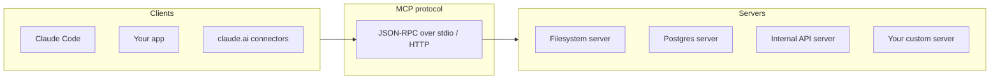

# 07 — MCP (Model Context Protocol)

By the end you can:

1. Explain MCP and why it exists.
2. Build a minimal MCP server in Python that exposes tools, resources, and prompts.
3. Consume an MCP server from Claude Code and from your own application.
4. Reason about security, transport, and where MCP shines vs plain tool use.

Time budget: ~60 minutes reading, ~75 minutes lab.

---

## 1. What MCP is

The **Model Context Protocol** is an open standard for connecting LLM applications to external capabilities. Think of it as **LSP for AI tools**: any compliant client (Claude Code, Claude.ai connectors, your app) can talk to any compliant server.



Without MCP, every LLM app reinvents:
- Auth to your tools.
- Schemas for your tools.
- Server lifecycle (start, restart, kill).
- Discovery (what tools exist?).

With MCP, you write the server **once** and every client gets it for free.

---

## 2. The three primitives

| Primitive | What | Analogy |
|---|---|---|
| **Tools** | Functions the model can call (with side effects). | Module 03 tool use. |
| **Resources** | Read-only content the model/user can reference. | Files, DB rows, API responses. |
| **Prompts** | Reusable prompt templates the user picks. | Slash commands, prompt snippets. |

A single server can expose any mix of the three.

---

## 3. Transport

Two main transports:

| Transport | Use |
|---|---|
| **stdio** | Local servers spawned as child processes. The standard for Claude Code; fast, no network. |
| **HTTP (Streamable HTTP)** | Remote servers, multi-tenant deployments, OAuth flows. |

The wire format is JSON-RPC 2.0 in both cases — same messages, different transport.

---

## 4. Build a minimal server (Python)

Using the official Python SDK `mcp`:

```python
# server.py
from mcp.server.fastmcp import FastMCP

app = FastMCP("hello-server")

@app.tool()
def add(a: int, b: int) -> int:
    """Add two integers."""
    return a + b

@app.resource("notes://{topic}")
def get_note(topic: str) -> str:
    """Read a sticky note for a topic."""
    return f"Note about {topic}: ..."

@app.prompt()
def code_review(language: str) -> str:
    """Generate a code review prompt for a given language."""
    return f"Review the following {language} code for bugs and style: \n\n{{code}}"

if __name__ == "__main__":
    app.run()   # defaults to stdio
```

That's a full MCP server. `FastMCP` registers the function signature as the JSON Schema automatically.

Run it locally:

```bash
python server.py
```

It now speaks MCP on stdio.

---

## 5. Consume from Claude Code

Add to `~/.claude.json` (or `.claude/settings.json`) under `mcpServers`:

```json
{
  "mcpServers": {
    "hello": {
      "command": "python",
      "args": ["/abs/path/to/server.py"]
    }
  }
}
```

Restart Claude Code. The tools, resources, and prompts now appear automatically — `/hello:code_review` becomes a slash command; `add` is callable from any agent turn; `notes://`-style URLs are addressable.

---

## 6. Consume from your own app

The Claude API supports **MCP connectors** so you can plug a remote MCP server straight into a Messages request:

```python
r = client.messages.create(
    model=MODEL,
    max_tokens=1024,
    mcp_servers=[
        {"type": "url", "url": "https://your-server.example.com/mcp", "name": "ops"},
    ],
    messages=[{"role": "user", "content": "Restart the staging API."}],
)
```

The API talks MCP server-side; the model gets the tools without you marshalling them into your request manually.

For local stdio servers in your own app, use the `mcp` client library directly:

```python
from mcp.client.stdio import stdio_client
from mcp.client.session import ClientSession

async with stdio_client({"command": "python", "args": ["server.py"]}) as (read, write):
    async with ClientSession(read, write) as session:
        await session.initialize()
        tools = await session.list_tools()
        result = await session.call_tool("add", {"a": 2, "b": 3})
```

---

## 7. When MCP is the right call

| Use MCP | Use plain tool use |
|---|---|
| You want the same capability available in Claude Code, claude.ai, and your app. | One-off tool for a single workflow. |
| You're integrating a system with a real protocol (DB, internal API). | You can express it in 20 lines of Python. |
| Multiple teams will consume the same capability. | Solo project. |
| You want hot-swappable servers (start/stop/restart). | Static tools that ship with your code. |

A simple rule: **if you'd write it as a CLI / microservice anyway, write it as MCP.** You get a free LLM-callable interface.

---

## 8. Security considerations

MCP servers are programs. Treat them as such.

- **Scope auth narrowly.** An MCP server with full prod database access is a foot-gun. Read-only by default.
- **Validate every tool input.** The model can be tricked into calling tools with adversarial inputs (prompt injection). Schema is not validation.
- **Sandbox local servers** for risky operations (file write, shell exec). The Claude Code harness already does some of this; your own client should too.
- **Audit logs** for every tool call. Especially side-effect tools.
- **Beware "resource exfiltration":** an MCP server can read sensitive files / DB rows and ship them through tool results. Limit exposure.
- **Remote MCP servers** require auth — usually OAuth 2.1. Don't ship a tool-server with an open endpoint.

Module 09 covers prompt injection defense, which interacts heavily with MCP.

---

## 9. Lab

[`lab.ipynb`](./lab.ipynb) walks through:
- Writing a 30-line MCP server in Python with a tool, resource, and prompt.
- Running it standalone and using the `mcp` CLI to inspect.
- Connecting to it from a small Python client.
- (Optional) Wiring it into Claude Code.

The lab notebook explains setup; the actual server lives at [`server.py`](./server.py).

---

## References

- MCP spec: <https://modelcontextprotocol.io/>
- Python SDK: <https://github.com/modelcontextprotocol/python-sdk>
- Server examples: <https://github.com/modelcontextprotocol/servers>
- API connector: <https://docs.claude.com/en/docs/agents-and-tools/mcp-connector>
- Claude Code MCP config: <https://docs.claude.com/en/docs/claude-code/mcp>
