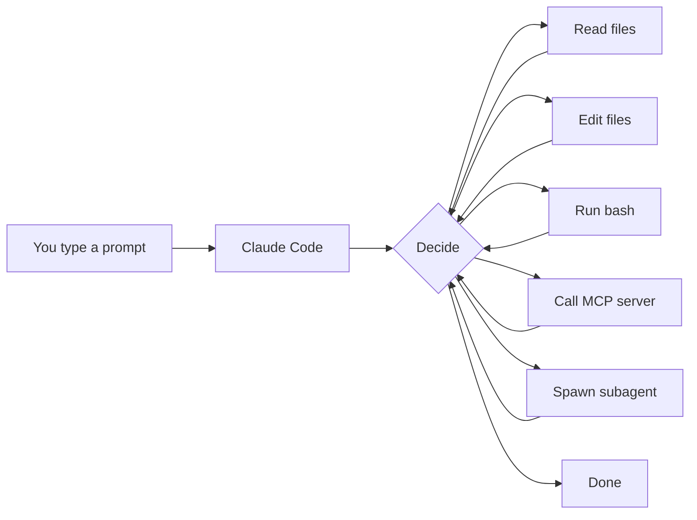

# 08 — Claude Code CLI

By the end you can:

1. Use Claude Code as a daily-driver coding assistant.
2. Customize it with `settings.json`: permissions, model, env, hooks.
3. Author slash commands, custom agents, and skills.
4. Wire MCP servers (from Module 07) into Claude Code.

Time budget: ~60 minutes reading, ~60 minutes lab.

---

## 1. What Claude Code is

Claude Code is Anthropic's official assistant **for engineers**. It lives in your terminal, your IDE, and your browser, and edits real files in real repos.

| Surface | When to use |
|---|---|
| **CLI** (`claude` in any terminal) | Default daily driver. |
| **Desktop app** (macOS / Windows) | Same CLI, integrated UI. |
| **Web** (claude.ai/code) | Cloud sandbox; great for `/ultrareview`, scheduled agents. |
| **IDE extensions** (VS Code, JetBrains) | Inline diffs, attach to current file/selection. |

This module is about the CLI/desktop experience — the deepest surface.

---

## 2. Install & first run

```bash
# macOS / Linux
curl -fsSL https://claude.com/install.sh | sh

# Windows
iwr https://claude.com/install.ps1 -useb | iex
```

Then run `claude` in any project directory. Authenticate with your Anthropic / Claude account on first launch.

> Authoritative install instructions: <https://docs.claude.com/en/docs/claude-code/setup>

---

## 3. The mental model

Claude Code is **an agent that runs in your repo**. Like any agent, it has:

- **Goal** — what you typed in the prompt.
- **Tools** — file edit, bash, web fetch, MCP servers, subagents.
- **Loop** — runs until the task is done or you stop it.
- **Context** — current working dir, `CLAUDE.md` files, prior messages.



The single most useful habit: **keep prompts goal-shaped, not step-shaped.** "Add a Redis cache to the auth service and update its tests" is better than "open foo.py, then write…". The agent plans the steps.

---

## 4. Daily workflows

### Workflow 1: feature work

```text
> Add a /healthz endpoint to the FastAPI app that returns {"ok": true, "version": <pkg version>}.
> Update tests in tests/test_health.py to cover it. Run pytest at the end.
```

The agent reads the project, makes the edits, runs tests, and reports. You review the diff.

### Workflow 2: code review

Use `/review` (built-in skill) on a PR or current branch. The agent reads the diff, runs checks, posts comments.

For higher-stakes review, `/ultrareview` (web-only) runs a multi-agent cloud review with several specialized critics in parallel.

### Workflow 3: investigation

```text
> Why is /api/users returning 500s in staging? Look at recent commits, logs in observability/, and the auth middleware.
```

The agent reads logs, traces, files; reports a hypothesis with citations.

### Workflow 4: refactor

Pair Claude Code with a `Plan` agent (subagent type):

```text
> Plan a refactor of the order service to extract domain logic into a separate module. Don't make changes yet.
```

Review the plan, then say "go" to execute.

---

## 5. `settings.json`

Three scopes, merged in order:

| File | Scope |
|---|---|
| `~/.claude/settings.json` | User (your machine, all projects) |
| `<repo>/.claude/settings.json` | Project (committed) |
| `<repo>/.claude/settings.local.json` | Local override (gitignored) |

Common keys (truncated; see docs for the full schema):

```jsonc
{
  "model": "claude-opus-4-7",
  "env": {
    "PYTHONUNBUFFERED": "1",
    "DEBUG": "true"
  },
  "permissions": {
    "allow": ["Bash(npm test:*)", "Bash(pytest:*)"],
    "deny":  ["Bash(rm -rf:*)", "Bash(git push --force:*)"]
  },
  "hooks": {
    "PreToolUse": [
      {"matcher": "Bash", "hooks": [{"type": "command", "command": "scripts/log-bash.sh"}]}
    ]
  }
}
```

### Permissions

`allow` lets a tool run without prompting; `deny` blocks even with explicit approval. Tighten this in CI / shared machines.

### Hooks

Hooks are shell commands the harness runs on events:

| Event | Fires when |
|---|---|
| `PreToolUse` | Before any tool call. Can deny via exit code. |
| `PostToolUse` | After any tool call. |
| `Stop` | When the agent finishes a turn. |
| `Notification` | When the agent needs your attention. |
| `UserPromptSubmit` | After you submit a prompt. |
| `SessionStart` / `SessionEnd` | Session lifecycle. |

Hooks are how you wire CI checks, formatters, audit logging, or "play a sound when the agent finishes."

> Reach for the `update-config` skill (`/update-config`) when you want Claude to edit `settings.json` for you.

---

## 6. Slash commands

A slash command is a saved prompt with optional args. Two ways to add one:

**1. Per-project markdown command** — drop a file at `.claude/commands/triage.md`:

```markdown
---
description: Triage a Linear ticket by URL.
---

You are a triage agent. Read the Linear ticket at the URL in $1.
Classify as bug/feature/question. Suggest a fix or owner. Reply concisely.
```

Use it as `/triage https://linear.app/...`.

**2. User-scoped commands** — same format, but under `~/.claude/commands/`.

---

## 7. Custom agents (subagent definitions)

A custom agent is a markdown file that defines a *specialized* Claude. The harness can spawn it as a subagent via the `Agent` tool.

`~/.claude/agents/db-migrator.md`:

```markdown
---
name: db-migrator
description: Use this agent for database schema migrations. Triggers on Alembic / Prisma / Django ORM changes.
tools: Read, Edit, Bash, Grep, Glob
---

You are a senior DBA. Whenever you change a schema, you ALSO:
1. Generate the migration.
2. Test up + down locally.
3. Note any data-loss risk in a `MIGRATION_NOTES.md`.
```

The main Claude Code instance will delegate to it when relevant.

---

## 8. Skills

Skills are like commands but bundle a prompt + tool permissions + extra files. They show up under `/skills/<name>`.

Bundled examples you already saw in this session:
- `init` — generates a `CLAUDE.md`.
- `review` — review a PR.
- `security-review` — security-focused review.
- `simplify` — review changed code for reuse / quality.
- `loop` — run a prompt repeatedly.
- `schedule` — schedule remote agents.
- `update-config` — edit `settings.json`.
- `claude-api` — building on the Claude API.

Author your own under `.claude/skills/<name>/SKILL.md` (project) or `~/.claude/skills/<name>/SKILL.md` (user). Each skill is a directory: a `SKILL.md` and optional supporting files.

---

## 9. MCP servers in Claude Code

From Module 07: register servers under `mcpServers` in your config. Once registered, every MCP tool, resource, and prompt becomes available in every session, automatically.

Useful built-ins to add:
- **filesystem** — read/write under a sandbox dir.
- **github** — issues, PRs, code search.
- **postgres** — query a dev DB.
- (Your own from Module 07.)

Manage them with `/mcp` from a session: list, reload, debug.

---

## 10. Keybindings & quality-of-life

- `Ctrl+C` — interrupt the current agent run (it'll keep what it has).
- `Esc Esc` — recall and edit the previous prompt.
- `!` prefix — run the rest of the line as a shell command, output piped into the session.
- `@` — attach a file or directory by path; the harness reads it.
- `#` — drop a note into a project `CLAUDE.md`.
- `/help` — full slash command index.
- `/agents` — list / configure custom agents.
- `/hooks` — inspect hooks.
- `/mcp` — inspect MCP servers.
- `/config` — open settings UI.

Customize bindings further with the `keybindings-help` skill.

---

## 11. Working with this course

A productive setup for studying:

1. Open this repo in Claude Code: `cd D:\Lourdu-Personal\claude && claude`.
2. Ask: *"Walk me through 03-tool-use/README.md and quiz me afterward."*
3. Add the MCP server from Module 07 to your config; ask Claude Code to call it.
4. Use the `loop` skill to set up self-paced practice sessions.

---

## 12. Lab

[`lab.md`](./lab.md) is a checklist of guided exercises in your real Claude Code install. (No notebook this module — it's all hands-on terminal work.)

---

## 13. Custom skills — a worked example

A skill is a directory with a `SKILL.md` and optional supporting files. The harness reads `SKILL.md` and makes the skill available under `/skills/<name>`. Here's a complete, copy-pasteable example you can drop into your repo.

**File**: `.claude/skills/triage/SKILL.md` (project-scoped) or `~/.claude/skills/triage/SKILL.md` (user-scoped):

```markdown
---
description: Triage a Linear, GitHub, or Jira issue by URL. Classify it and suggest next steps.
---

You are a triage assistant.

The user will give you a URL to an issue or ticket. Your job:

1. Read the issue content (fetch the URL if you have web access, or ask the user to paste the body).
2. Classify it: **bug** / **feature** / **question** / **other**.
3. Assess severity for bugs: **critical** (data loss, security, downtime), **major** (core feature broken), **minor** (edge case, cosmetic).
4. Suggest: who should own it (if the project has teams), what to check first, and whether it needs a repro.
5. If it's a bug, suggest the smallest repro step you can infer.

Keep the reply short — 4–8 sentences. Use bullets for the classification and suggestion.

If the URL is unreachable or the body is empty, ask the user to paste the issue text.
```

**What makes this a good skill**:
- The frontmatter `description` tells the harness when to offer it automatically.
- The prompt is specific about output format and length — good skills constrain the answer, not just the task.
- It handles the empty/reachable case explicitly rather than failing silently.

**Test it**: drop the file, restart Claude Code, then type `/skills/triage` and pass a URL. Review the output; iterate on the prompt if it's too verbose or misses the classification.

> For the full skill schema and authoring guide, see the [Claude Code skills docs](https://docs.claude.com/en/docs/claude-code/skills).

---

## 14. A starter hooks configuration

Hooks let you run shell commands at key points in the agent loop. Here's a realistic `settings.json` that logs every bash command to a file and runs a formatter check after any file edit.

**File**: `.claude/settings.json` (project-scoped, commit this one):

```jsonc
{
  "model": "claude-sonnet-4-6",
  "env": {
    "PYTHONUNBUFFERED": "1"
  },
  "hooks": {
    "PreToolUse": [
      {
        "matcher": "Bash",
        "hooks": [
          {
            "type": "command",
            "command": "echo \"$(date -Iseconds) $CLAUDE_CODE_COMMAND\" >> .claude/bash-log.csv"
          }
        ]
      }
    ],
    "PostToolUse": [
      {
        "matcher": "Edit",
        "hooks": [
          {
            "type": "command",
            "command": "python -m ruff check ${CLAUDE_CODE_FILEPATH} || true"
          }
        ]
      }
    ]
  }
}
```

**What this does**:
- **PreToolUse on Bash**: every command the agent runs gets logged to `.claude/bash-log.csv` with a timestamp. Useful for audit, debugging, or later review.
- **PostToolUse on Edit**: after any file edit, runs `ruff check` on the edited file. The `|| true` means a lint failure won't block the agent — it just reports it. Replace `ruff` with your own linter; the pattern is what matters.

**Important**: hooks run in the project directory. Keep them fast — a hook that takes more than a few seconds will slow every tool call. Avoid network calls in hot hooks.

**Local overrides**: put machine-specific values (personal API keys used by hooks, local paths) in `.claude/settings.local.json` and keep it gitignored. The harness merges: user → project → local.

> For the full hook schema and event list, see [Claude Code hooks](https://docs.claude.com/en/docs/claude-code/hooks).

---

## References

- Claude Code overview: <https://docs.claude.com/en/docs/claude-code/overview>
- Settings reference: <https://docs.claude.com/en/docs/claude-code/settings>
- Hooks: <https://docs.claude.com/en/docs/claude-code/hooks>
- Custom agents: <https://docs.claude.com/en/docs/claude-code/sub-agents>
- Skills: <https://docs.claude.com/en/docs/claude-code/skills>
- MCP: <https://docs.claude.com/en/docs/claude-code/mcp>
- Keybindings: <https://docs.claude.com/en/docs/claude-code/keybindings>
