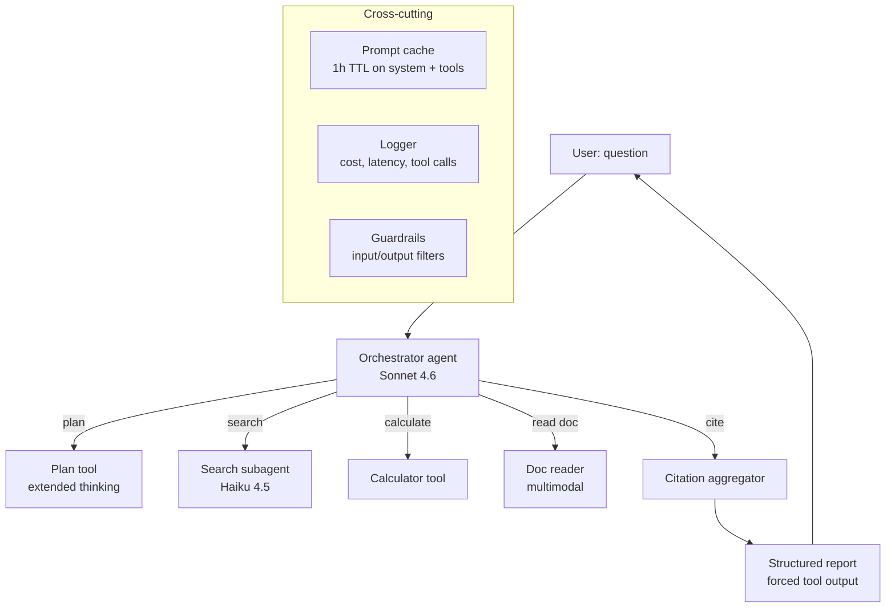

# 10 — Capstone: ship a real agentic assistant

This module ties together everything before it. You'll build a CLI **Research Assistant** that:

- Takes a research question.
- Plans an approach.
- Uses tools (web search, calculator, document read) to investigate.
- Spawns subagents for isolated subtasks.
- Returns a cited, structured report.
- Has prompt caching, retries, evals, and guardrails.

Time budget: 4–8 hours, spread across a week.

---

## 1. Architecture



Stack:

| Concern | Choice |
|---|---|
| API | Anthropic SDK |
| Tools | Module 03 forced tools + plain tool loop |
| Subagents | Hand-rolled (Module 06) |
| Structured output | Pydantic + forced tool (Module 05) |
| Caching | 1-hour cache breakpoint on system + tools (Module 05) |
| Eval | JSONL set + LLM-as-judge (Module 09) |
| Guardrails | Input length cap; XML-tagged untrusted content; output redaction (Module 09) |
| MCP (optional) | Custom server for your domain tools (Module 07) |
| CLI | `argparse` + `rich` for streaming output |

---

## 2. Deliverables

A working repo under `10-capstone/app/` with:

```
app/
├── README.md              # how to run + design notes
├── assistant.py           # orchestrator entrypoint
├── tools.py               # tool definitions + impls
├── subagents.py           # search subagent etc.
├── schemas.py             # Pydantic models for inputs/outputs
├── guardrails.py          # input/output filters
├── eval/
│   ├── set.jsonl          # 20 hand-crafted (question, expected) pairs
│   ├── judge.py           # LLM-as-judge grader
│   └── run.py             # runs the assistant on the set, prints scores
└── cli.py                 # CLI entrypoint (streaming)
```

Plus:

- **Recording of a real session** (terminal cast or copy-paste) saved in `app/demo.md`.
- **Eval score** in `app/eval/scores.csv` from your most recent run.

---

## 3. Milestones

### Day 1 — Plumbing (1–2h)

- [ ] `pip install -r ../../requirements.txt`.
- [ ] Skeleton files exist; `python cli.py "hello"` returns a Claude response.
- [ ] One real tool wired in (e.g. calculator) end-to-end.
- [ ] Cost & token usage logged per call.

### Day 2 — Tools (1–2h)

- [ ] At least 3 tools: search, calculator, doc_read (or read_url).
- [ ] Forced structured output for the final report (Pydantic schema).
- [ ] Tool loop runs end-to-end on a multi-step question.

### Day 3 — Subagents + caching (1–2h)

- [ ] Search subagent on Haiku; orchestrator on Sonnet.
- [ ] Cache breakpoint on system + tools; verify hit ratio in logs.
- [ ] Step budget + per-call cost circuit-breaker.

### Day 4 — Evals (1h)

- [ ] 20-row eval JSONL.
- [ ] LLM-as-judge with a tight rubric.
- [ ] `python eval/run.py` prints overall score and per-row breakdown.

### Day 5 — Guardrails & polish (1h)

- [ ] Input length cap.
- [ ] Untrusted-content wrapping for any web fetches.
- [ ] Output redaction pass.
- [ ] Streaming CLI UX with `rich`.
- [ ] `demo.md` with a recorded session.

---

## 4. Starter code

Files under [`app/`](./app/) are stubs to get you moving. Each has a `# TODO` for the work you do.

| File | What's stubbed |
|---|---|
| `app/assistant.py` | Orchestrator loop with step budget and cost tracking |
| `app/tools.py` | Tool schemas + 1 sample implementation |
| `app/schemas.py` | Pydantic schemas for the final report |
| `app/cli.py` | Streaming CLI entrypoint |
| `app/eval/set.jsonl` | 5 seed rows; add 15 more |
| `app/eval/run.py` | Runner + judge wiring |

You don't have to use the stubs — they're a starting point if you want one.

---

## 5. Stretch ideas

- **Custom MCP server** exposing a niche dataset you care about (Module 07). Plug it into Claude Code too.
- **Web UI** with FastAPI + SSE streaming.
- **Persistent memory** across sessions backed by SQLite.
- **Eval CI gate**: a GitHub Action that runs the eval and fails the build if regression > 5%.
- **Observability**: emit OpenTelemetry spans; visualize in Phoenix.

---

## 6. Grading rubric (self-assessment)

Score yourself on each row. Aim for 4/5 average before calling it done.

| Criterion | 1 — missing | 3 — basic | 5 — production-ready |
|---|---|---|---|
| Tool design | Vague tools; ambiguous schemas | 3 tools, clear schemas | Schemas validated server-side; error returns |
| Agent loop | No step budget | Budget present | Budget + cost circuit-breaker + retries |
| Caching | None | Single breakpoint on system | Breakpoints on system + tools + docs; measured hit ratio |
| Subagents | None | 1 subagent of a different model | Multi-model dispatcher; isolated contexts; measurable speedup |
| Structured output | Free text | JSON via prompt | Forced tool + Pydantic validation |
| Evals | None | 5 hand-graded inputs | 20+ inputs; LLM-as-judge with rubric; CSV scores |
| Guardrails | None | Output redaction | Input cap + untrusted-content quarantine + output filter |
| UX | Script | CLI prints results | Streaming CLI with progress + cost |

---

## 7. What "done" looks like

You demo this to a colleague in 5 minutes:

1. *"It answers research questions, citing sources."* — show a real run, streaming.
2. *"It plans, then acts."* — point at the plan emitted before tool calls.
3. *"It costs about $X/query"* — show your cost log.
4. *"And here's how I know it works."* — show the eval scores.

That's the bar.

---

## 8. References

Cross-references to prior modules:
- Tools: [Module 03](../03-tool-use/)
- Multimodal: [Module 04](../04-multimodal/)
- Caching / batch / thinking: [Module 05](../05-advanced-api/)
- Agent patterns: [Module 06](../06-agents/)
- MCP integration: [Module 07](../07-mcp/)
- Evals, guardrails, observability: [Module 09](../09-production/)
