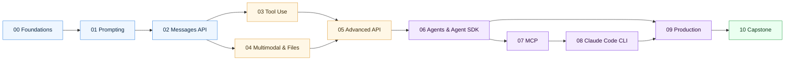

# Claude — Beginner to Advanced

A self-paced course covering the Claude API, Agent SDK, MCP, and the Claude Code CLI. Built for engineers who want production-grade fluency, not just demos.

> Author note: this is my personal learning track. Each module is a focused lesson + a runnable lab + exercises. Work through them in order, or jump to a topic.

---

## Who this is for

You already write Python. You have an Anthropic API key. You want to:
- Build real applications on Claude (not toy chatbots).
- Understand the *whole stack*: prompting, the Messages API, tool use, agents, MCP, evals, cost & latency.
- Learn the Claude Code CLI as a daily-driver tool.

If that's you, start at Module 00.

---

## Learning path



---

## Modules

| # | Module | Level | What you'll be able to do |
|---|---|---|---|
| 00 | [Foundations](./00-foundations/) | Beginner | Send your first Claude request; pick the right model |
| 01 | [Prompting](./01-prompting/) | Beginner | Write reliable prompts with system, XML, few-shot, and CoT |
| 02 | [Messages API](./02-messages-api/) | Beginner | Stream, multi-turn, count tokens, handle errors and retries |
| 03 | [Tool use](./03-tool-use/) | Intermediate | Define tools, run the tool loop, use parallel & structured outputs |
| 04 | [Multimodal & files](./04-multimodal/) | Intermediate | Vision, PDFs, the Files API, and citations |
| 05 | [Advanced API](./05-advanced-api/) | Intermediate | Prompt caching, batch, extended thinking, model selection |
| 06 | [Agents & Agent SDK](./06-agents/) | Advanced | Build agent loops, memory, subagents, and planning |
| 07 | [MCP](./07-mcp/) | Advanced | Build & consume Model Context Protocol servers |
| 08 | [Claude Code CLI](./08-claude-code/) | Advanced | Daily-drive Claude Code with hooks, MCP, custom agents, skills |
| 09 | [Production](./09-production/) | Advanced | Cost/latency, evals, RAG, guardrails, observability, security |
| 10 | [Capstone](./10-capstone/) | Capstone | Ship an agentic assistant end-to-end |

---

## Setup

```bash
# 1. Clone
git clone https://github.com/Lourdhu02/claude.git
cd claude

# 2. Virtualenv
python -m venv .venv
# Windows
.venv\Scripts\activate
# macOS / Linux
source .venv/bin/activate

# 3. Install deps
pip install -r requirements.txt

# 4. Configure key
cp .env.example .env       # then edit .env and paste your key

# 5. Launch Jupyter for labs
jupyter lab
```

Get an API key at <https://console.anthropic.com/settings/keys>.

---

## How each module is structured

```
NN-module/
├── README.md       # the lesson (read this first)
├── lab.ipynb       # runnable Jupyter notebook (do this second)
└── exercises.md    # problems with hints; solutions at the bottom
```

A typical session: ~30 min reading the README, ~30–60 min in the lab, ~30 min on exercises. Modules build on each other but each is self-contained enough to revisit.

---

## Model cheat sheet

| Use case | Model | Notes |
|---|---|---|
| Hardest reasoning, agentic loops | `claude-opus-4-7` | Most capable; slowest, priciest |
| Default workhorse | `claude-sonnet-4-6` | Best price/performance |
| Latency-critical, cheap classification | `claude-haiku-4-5-20251001` | Fastest, cheapest |

Pricing and rate limits live at <https://docs.claude.com/en/docs/about-claude/pricing>. Always read current docs before production use.

---

## Repository layout

```
claude/
├── README.md
├── LICENSE
├── .env.example
├── .gitignore
├── requirements.txt
├── 00-foundations/
├── 01-prompting/
├── 02-messages-api/
├── 03-tool-use/
├── 04-multimodal/
├── 05-advanced-api/
├── 06-agents/
├── 07-mcp/
├── 08-claude-code/
├── 09-production/
├── 10-capstone/
└── resources/
    └── glossary.md
```

---

## Conventions used in this course

- **All code is Python 3.10+.**
- **`.env` holds your key.** Never commit it.
- **Model IDs are pinned in `.env`** so you change them in one place.
- **Mermaid for diagrams.** Renders in GitHub natively — no images to manage.
- **Tables over walls of prose** when comparing options.
- **Footnotes for sources.** Every claim that quotes a limit, price, or capability links to the docs.

---

## License

MIT — see [LICENSE](./LICENSE).
