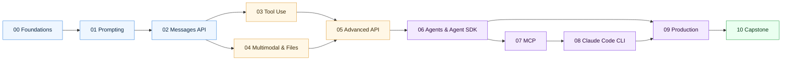

# Claude — Beginner to Advanced

A self-paced course covering the Claude API, Agent SDK, MCP, and the Claude Code CLI. Built for engineers who want production-grade fluency, not just demos.

```
┌──────────────────────────────────────────────────────────────┐
│  Claude — Beginner to Advanced                              │
│  Claude API · Agent SDK · MCP · Claude Code · Evals         │
└──────────────────────────────────────────────────────────────┘
```

[](https://www.python.org/)
[](./LICENSE)
[](https://github.com/anthropic-ai/sdk)
[](https://jupyter.org/)

```
10 modules  ·  6 prompt templates  ·  4 workflows  ·  MIT licensed
00 Foundations → 10 Capstone  ·  Labs + exercises in every module
```

> Author note: this is my personal learning track. Each module is a focused lesson + a runnable lab + exercises. Work through them in order, or jump to a topic.

---

## 5-minute quick start

If you have an API key and Python installed, you can make your first Claude request in under 5 minutes:

```bash
# Clone and enter the repo
git clone https://github.com/Lourdhu02/claude.git
cd claude

# Create a virtualenv and install deps
python -m venv .venv
.venv/Scripts/activate        # Windows
# source .venv/bin/activate   # macOS / Linux
pip install -r requirements.txt

# Paste your key into .env
cp .env.example .env
# → open .env and replace «redacted:sk-…» with your key

# Run the first lab
jupyter lab
# → open 00-foundations/lab.ipynb and run the cells
```

That's it. The first lab sends a request and prints the response. From there, work through Module 00's README for the concepts.

> **No key yet?** You can still read the READMEs — every module explains the concepts without requiring a live API call. Get a key at <https://console.anthropic.com/settings/keys> when you're ready to run the labs.

---

## Who this is for

You already write Python. You have an Anthropic API key. You want to:
- Build real applications on Claude (not toy chatbots).
- Understand the *whole stack*: prompting, the Messages API, tool use, agents, MCP, evals, cost & latency.
- Learn the Claude Code CLI as a daily-driver tool.

If that's you, start at Module 00.

---

## Learning path



---

## Modules

| # | Module | Level | What you'll be able to do |
|---|---|---|---|
| 00 | [Foundations](./00-foundations/) | Beginner | Send your first Claude request; pick the right model |
| 01 | [Prompting](./01-prompting/) | Beginner | Write reliable prompts with system, XML, few-shot, and CoT |
| 02 | [Messages API](./02-messages-api/) | Beginner | Stream, multi-turn, count tokens, handle errors and retries |
| 03 | [Tool use](./03-tool-use/) | Intermediate | Define tools, run the tool loop, use parallel & structured outputs |
| 04 | [Multimodal & files](./04-multimodal/) | Intermediate | Vision, PDFs, the Files API, and citations |
| 05 | [Advanced API](./05-advanced-api/) | Intermediate | Prompt caching, batch, extended thinking, model selection |
| 06 | [Agents & Agent SDK](./06-agents/) | Advanced | Build agent loops, memory, subagents, and planning |
| 07 | [MCP](./07-mcp/) | Advanced | Build & consume Model Context Protocol servers |
| 08 | [Claude Code CLI](./08-claude-code/) | Advanced | Daily-drive Claude Code with hooks, MCP, custom agents, skills |
| 09 | [Production](./09-production/) | Advanced | Cost/latency, evals, RAG, guardrails, observability, security |
| 10 | [Capstone](./10-capstone/) | Capstone | Ship an agentic assistant end-to-end |

---

## What you'll build

This course doesn't end with theory. By Module 10 you'll have built and shipped a real CLI application — a **Research Assistant** — that answers questions by planning, searching, calculating, reading documents, and citing sources, then reports back with a structured, citable answer.

| Milestone | What you'll have |
|---|---|
| Day 1 | A working CLI that talks to Claude — your first real request, end to end |
| Day 2 | Three tools wired in (search, calculator, document reader); forced structured output |
| Day 3 | A multi-model agent: Haiku subagents for search, Sonnet orchestrator for planning |
| Day 4 | An eval suite of 20+ questions with an LLM-as-judge grader and CSV scores |
| Day 5 | Guardrails (input cap, untrusted-content quarantine, output redaction) and a polished streaming CLI |

The full spec is in [Module 10 — Capstone](./10-capstone/). The starter code is already in [`10-capstone/app/`](./10-capstone/app/) — each file has a `# TODO` for the work you do.

---

## Setup

```bash
# 1. Clone
git clone https://github.com/Lourdhu02/claude.git
cd claude

# 2. Virtualenv
python -m venv .venv
# Windows
.venv\Scripts\activate
# macOS / Linux
source .venv/bin/activate

# 3. Install deps
pip install -r requirements.txt

# 4. Configure key
cp .env.example .env       # then edit .env and paste your key

# 5. Launch Jupyter for labs
jupyter lab
```

Get an API key at <https://console.anthropic.com/settings/keys>.

---

## How each module is structured

```
NN-module/
├── README.md       # the lesson (read this first)
├── lab.ipynb       # runnable Jupyter notebook (do this second)
└── exercises.md    # problems with hints; solutions at the bottom
```

A typical session: ~30 min reading the README, ~30–60 min in the lab, ~30 min on exercises. Modules build on each other but each is self-contained enough to revisit.

---

## Model cheat sheet

| Use case | Model | Notes |
|---|---|---|
| Hardest reasoning, agentic loops | `claude-opus-4-7` | Most capable; slowest, priciest |
| Default workhorse | `claude-sonnet-4-6` | Best price/performance |
| Latency-critical, cheap classification | `claude-haiku-4-5-20251001` | Fastest, cheapest |

Pricing and rate limits live at <https://docs.claude.com/en/docs/about-claude/pricing>. Always read current docs before production use.

---

## Repository layout

```
claude/
├── README.md
├── LICENSE
├── .env.example
├── .gitignore
├── requirements.txt
├── 00-foundations/
├── 01-prompting/
├── 02-messages-api/
├── 03-tool-use/
├── 04-multimodal/
├── 05-advanced-api/
├── 06-agents/
├── 07-mcp/
├── 08-claude-code/
├── 09-production/
├── 10-capstone/
└── resources/
    └── glossary.md
```

---

## Conventions used in this course

- **All code is Python 3.10+.**
- **`.env` holds your key.** Never commit it.
- **Model IDs are pinned in `.env`** so you change them in one place.
- **Mermaid for diagrams.** Renders in GitHub natively — no images to manage.
- **Tables over walls of prose** when comparing options.
- **Footnotes for sources.** Every claim that quotes a limit, price, or capability links to the docs.

---

## Troubleshooting & FAQ

**I get a 401 / "invalid API key" error.**
Your `ANTHROPIC_API_KEY` is missing, expired, or not loaded. Check: (1) `.env` exists and has a real key (starts with `sk-ant-`), not the `«redacted:…»` placeholder. (2) You restarted the Jupyter kernel after creating `.env` — the SDK reads the env at import time. (3) The key hasn't been revoked at <https://console.anthropic.com/settings/keys>.

**I get a 429 / rate limit error.**
You've hit a rate limit or run out of billing credit. Check: (1) billing credit at <https://console.anthropic.com/settings/plans-billing> — without credit, requests 429. (2) If you're looping quickly, add a retry with backoff — the SDK's `tenacity` integration handles this, or see Module 02 for a manual retry pattern. (3) You may be on a free tier with strict limits; check your plan.

**Which model should I use?**
Start with `claude-sonnet-4-6` — it's the default in `.env.example` for a reason. Use Haiku (`claude-haiku-4-5-20251001`) for cheap, fast, simple tasks. Use Opus (`claude-opus-4-7`) only when the task genuinely needs the highest reasoning ability and the cost is justified. See the [model cheat sheet](#model-cheat-sheet) above.

**Do I need to pay for this course?**
No — the course content (READMEs, labs, exercises) is free to read. You only pay for your own API usage when running the labs. Anthropic has a free tier; check <https://console.anthropic.com/settings/plans-billing> for current pricing. A few labs may cost a few cents each; the capstone could cost a few dollars if you run the full eval suite.

**I don't have an API key yet. Can I still follow the course?**
Yes. Every module's README explains the concepts without requiring a live call. The labs need a key, but you can read them to understand what they do, then run them when you're ready. Get a key at <https://console.anthropic.com/settings/keys>.

**The lab notebook won't start (Jupyter errors).**
Make sure you activated the virtualenv *before* running `jupyter lab`. On Windows: `.venv\Scripts\activate` then `jupyter lab`. On macOS/Linux: `source .venv/bin/activate` then `jupyter lab`. If the kernel selector in Jupyter doesn't show a Python kernel, run `python -m ipykernel install --user --name=.venv` from the activated venv.

**Something in the course is outdated (wrong model name, wrong API field).**
Anthropic updates the API regularly. Open an issue at <https://github.com/Lourdhu02/claude/issues> with what you found and what you think is correct — or submit a PR. See [CONTRIBUTING.md](./CONTRIBUTING.md).

---

## License

MIT — see [LICENSE](./LICENSE).

## Claude Projects

This repo now includes reusable assets you can copy into your own projects:

| Asset | File | What it is |
|---|---|---|
| Prompt library | [`prompts.md`](./prompts.md) | 6 ready-to-use system prompts: code assistant, data analysis, creative writing, document Q&A, brainstorming, generic |
| Workflow library | [`workflows.md`](./workflows.md) | 4 step-by-step workflows: code review, documentation generation, testing, debugging |
| Integration | [Module 07 — MCP](./07-mcp/) + [Module 08 — Claude Code](./08-claude-code/) | Connect Claude to your tools and IDE |

Use them as-is, adapt them, or use them as a starting point for your own prompts and workflows.
